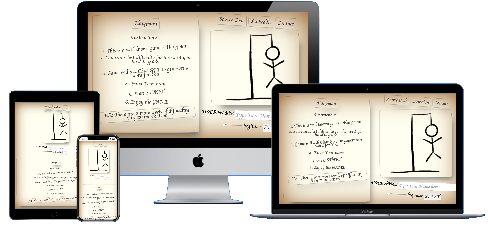

# Hangman Game
[Link to live page](https://tomosius.github.io/P2-HangMan/)

Welcome to the Hangman Game! This is a simple web-based implementation of the classic Hangman word-guessing game. Players attempt to guess a hidden word by suggesting letters, with a limited number of incorrect guesses allowed before the hangman is fully drawn.

# Hangman Game Documentation

## Table of Contents

- [Introduction](#introduction)
- [User Experience (UX)](#user-experience-ux)
- [Design](#design)
    - [Page Layout](#page-layout)
    - [Fonts](#fonts)
    - [Color Palette](#color-palette)
    - [Responsiveness](#responsiveness)
- [Testing](#testing)
    - [Compatibility](#compatibility)
    - [Manual Testing](#manual-testing)
    - [Browser Compatibility](#browser-compatibility)
- [Validation](#validation)
- [Technologies](#technologies)
    - [Languages used](#languages-used)
    - [Bootstrapping](#bootstrapping)
    - [Tools used](#tools-used)
- [Features](#features)
    - [GamePlay](#gameplay)
    - [Difficulty Leveels](#difficulty-levels)
- [Functions](#functions)
  - [hangmanImageUpdate](#hangmanimageupdate)
  - [updateSliderDifficultyLabel](#updatesliderdifficultylabel)
  - [chooseWord](#chooseword)
  - [updateHiddenWord](#updatehiddenword)
  - [createAlphabet](#createalphabet)
  - [letterGuess](#letterguess)
  - [updateTimerDisplay](#updatetimerdisplay)
  - [startTimer](#starttimer)
  - [updateTimer](#updatetimer)
  - [newGame](#newgame)
  - [gameTryAgainButton](#gametryagainbutton)
  - [gameTryAgainButtonOther](#gametryagainbuttonother)
  - [newGameOther](#newgameother)
  - [gameOver](#gameover)
  - [logPlayerActions](#logplayeractions)
  - [contactForm](#contactform)
  - [createForm](#createform)
  - [rearrangeNavigation](#rearrangenavigation)
  - [homePage](#homepage)
  - [playerActionsTable](#playeractionstable)

# Hangman Game Documentation

## User Experience (UX)

The Hangman game provides an engaging user experience through its intuitive interface and interactive gameplay. The following features contribute to a seamless and enjoyable user experience:

- Clear instructions explaining how to play the game.
- An interactive form for the user to enter their name and select the difficulty level.
- Visual feedback through animations, transitions, and hover effects on buttons.
- Mobile responsiveness for optimal gameplay on different devices.

## Design

### Page Layout

The design of the Hangman game focuses on creating an appealing and user-friendly environment for players. Here are the design aspects that contribute to the overall look and feel of the game:

### Fonts

Two custom fonts were selected to enhance the visual appeal and uniqueness of the game's interface:

- **Handwritten Font**: The "Handwritten" font is used for most of the text elements, giving the game a playful and informal vibe.
- **Mono Font**: The "Mono" font is used for specific text elements to create a clear and easily readable appearance.

### Color Palette

The color palette is chosen to provide a balance between readability and visual interest:

- Background: #fffef0 (light cream)
- Text: #403e41 (dark gray)
- Accent: rgba(136, 8, 8, 1) (deep red)

### Layout

The game layout is divided into two main sections: the right side and the left side. This division optimizes screen space and ensures a comfortable gaming experience on both larger screens and mobile devices:

- **Right Side**: Contains navigation links, an image of a hanged man, and a log of player actions.
- **Left Side**: Displays instructions, the game's title, and the area where the user interacts with the game.

### Responsiveness

The game layout adapts gracefully to different screen sizes using media queries:

- For screens with a width of 450px or less, or in portrait orientation, the layout adjusts to ensure optimal viewing and interaction.

These design elements come together to create an inviting and enjoyable atmosphere for players, making the Hangman game an engaging and visually appealing experience.

## Testing
### Compatibility
Website was tested for appearance, functionality or responsiveness on these devices:
* Ipad Pro 12.9"
* Macbook Air 13"
* Iphone 12
All these devices have used Safari, Firefox and Google Chrome browsers
### Manual Testing
* Device compatibility

| Device | Test | Result |
| --- | --- | --- |
| MacBook Air 13" | No appearance, responsiveness nor functionality issues. | Pass |
| iPad Pro 12.9" | No appearance, responsiveness nor functionality issues. | Pass |
| iPhone 8 | No appearance, responsiveness nor functionality issues. | Pass |

### Browser Compatibility

| Browser | Test | Result  |
--- | --- | ---
Google Chrome | No appearance, responsiveness nor functionality issues.| Pass
Safari | No appearance, responsiveness nor functionality issues. | Pass
Mozilla Firefox | Scrollbar is visible even though it should be hidden.  No responsiveness nor functionality issues.| Pass
Microsoft Edge | No appearance, responsiveness nor functionality issues. | Pass
## Validation

[Back to top ⇧](#rpsls)
## Technologies
### Languages used
 

### Bootstrapping
* Fonts were used from Google Fonts
* Icons Icomns were not useed as intention of all layout - handwriten oon paper style
### Tools used
* Gimp for cropping  and adjusting images
* Visual Studio Code - as Code Editor
* Git / GitHub for Version Control
* Shields.io for badges used in README.md

[Back to top ⇧](#rpsls)
## Features

- Choose from different difficulty levels, ranging from beginner to legendary.
- Guess letters to uncover the hidden word.
- Interactive hangman image that updates with each incorrect guess.
- Timed gameplay with a countdown timer.
- Player actions log to track each game's progress and outcomes.
- Contact form for users to provide feedback or inquire.

[Back to top ⇧](#rpsls)

## Usage

### Gameplay
1. Upon opening the game, you'll be presented with the option to choose a difficulty level using a slider.
2. Click the "Start Game" button to begin. The game will display a hidden word as a series of underscores.
3. Use the on-screen buttons to guess letters. Each correct guess will reveal the position of the letter in the word. Incorrect guesses will update the hangman image.
4. The game ends when the word is fully revealed (win) or the hangman is completed (loss).
5. User is presented only with first 5 levels of difficulty, after succeeding highest, one more will be revealed and so on, till Legendary difficulty is unlocked.

[Back to top ⇧](#rpsls)

### Difficulty Levels
The game offers the following difficulty levels:

* Beginner
* Easy
* Intermediate
* Advanced
* Expert
* Master
* Legendary

Each level corresponds to a different set of words, with varying levels of complexity.

[Back to top ⇧](#rpsls)

## Functions

Here are the functions used in the Hangman game:

### hangmanImageUpdate
This function updates the hangman image based on the current mistake count.

### updateSliderDifficultyLabel
This function updates the displayed difficulty label (on HTML page) based on the slider value.

### chooseWord
This function selects a random word based on the chosen difficulty level and initializes the hidden word array.

### updateHiddenWord
This function updates the displayed hidden word on the screen.

### createAlphabet
This function creates and displays clickable alphabet buttons for letter guessing.

### letterGuess
This function handles a letter guess, updates the hidden word, and logs player actions.

### updateTimerDisplay
This function updates the countdown timer display.

### startTimer
This function starts the timer when a game begins.

### updateTimer
This function calculates and updates the elapsed time during gameplay.

### newGame
This function starts a new game, resetting various game-related variables and UI elements.

### gameTryAgainButton
This function displays the "Try Again" button on the game over screen.
* If player was already playing EASIEST (**Beginner**) level, it will change button text contents accordingly
* If player has won hardest (**Legendary**) level, text within button will congratulate player and will offer to try iit again

### gameTryAgainButtonOther
This function displays the "Try Again" button with a different difficulty level on the game over screen. When button pressed, will initiate function **newGameOther**
* If player has lost, it will offer easier difficulty based on one player just jas lost
* If player won, then button will offer harder difficulty to try
* Function also checks, was it Beginner or Legendary difficulties, if so, this button will not be revealed

### newGameOther
This function starts a new game with a different difficulty level.

### gameOver
This function handles the game over state, including logging player actions and displaying appropriate buttons. 

### logPlayerActions
This function logs player actions, including the current game's progress and outcome.

### contactForm
**contact** hyperlink clicked in NAV section will triger function **contactForm**, which will initiate other functions to change layout of page feedback or inquiries. 
### createForm
This function creates the contact form elements, where player can fill details and post them.

### rearrangeNavigation
This function rearranges navigation links based on the current page. Button **Contact** becomes **Home** page and will be moved to left

### homePage
This function restores the homepage content and functionality:
* Restores HomePage text and layout
* Stops the times
* Restores instructions
* Restores main image to default
By using function instead of manually refreshing page, player can keepp current game progress (win loose and etc).

### playerActionsTable
This function is intended for a player actions table:
* Each game log output is visible in table
* Eacg game will have sub-table for every guessing attempt made by player

[Back to top ⇧](#rpsls)

## To Do List

### Implement ChatGPT generating words
I want in future to improve this code, so Ai could generate words, the downside Api Key has to be hidden, so will need to think a way around it.
###  Player actions log output
Also i would like in future to make separate file, where all player actions in Game could be stored and emailed to player if such thing is desired.